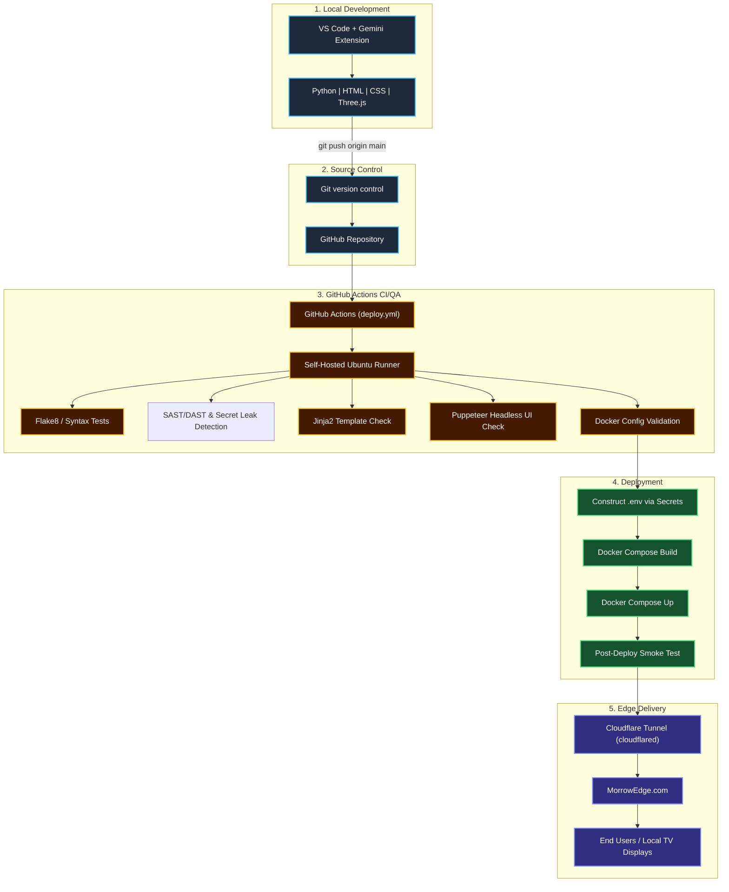

# 🏗️ BEACON Pipeline & Architecture

This document visually outlines the CI/CD pipeline, architecture, and deployment strategy for **Morrow Edge | BEACON**.

## 1. Textual Visual (ASCII Flow)

```text
=============================================================================================
                                  BEACON CI/CD PIPELINE
=============================================================================================

 [ 💻 Local Dev ]            [ 🐙 Source Control ]               [ ⚙️ CI/QA (Self-Hosted) ]
 VS Code + Gemini                Git Push                      GitHub Actions Runner
 (Py/HTML/CSS/3JS) ────────────> (Branch: main) ─────────────> ├─> 1. Flake8 Linting
                                                               ├─> 2. SAST/DAST & Secret Leak Detection
                                                               ├─> 3. compileall Syntax Check
                                                               ├─> 4. Jinja2 Validation
                                                               ├─> 5. Puppeteer UI & Modals
                                                               └─> 6. Docker Config Check
                                                                          │
                                                                          ▼
 [ 🌍 Edge Delivery ]        [ ☁️ Tunneling ]                    [ 🚀 Deployment ]
 MorrowEdge.com                Cloudflare                      ├─> 1. Inject Secrets (.env)
 TVs / Displays    <─────────  Zero Trust      <────────────── ├─> 2. Docker Compose Build
 Mobile & Web                  (cloudflared)                   ├─> 3. Docker Compose Up -d
                                                               └─> 4. Smoke Test (cURL Web/RPG)
=============================================================================================
```

## 2. Mermaid Diagram (GitHub Native)



---
*Note: Deployments are handled exclusively by the GitHub Runner. Manual `docker compose up` is not supported on the host machine to maintain CI integrity.*